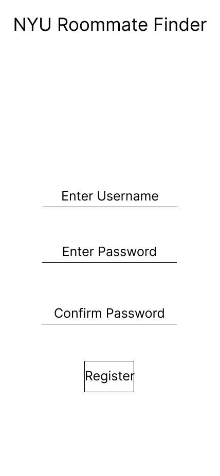
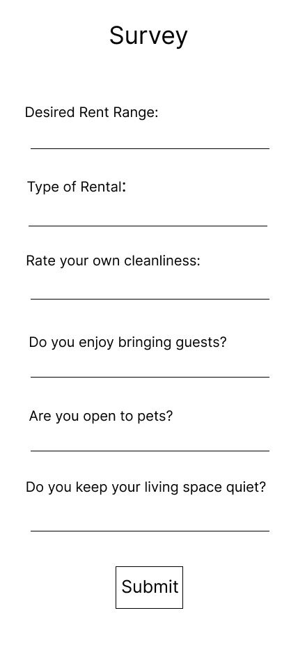
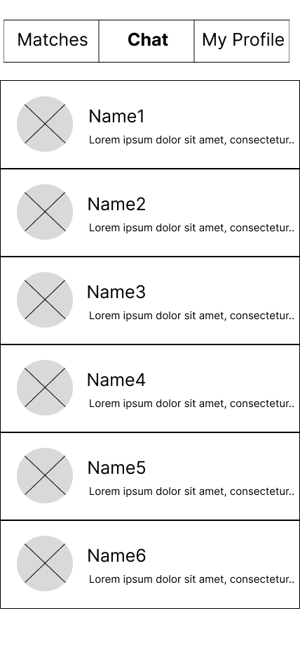
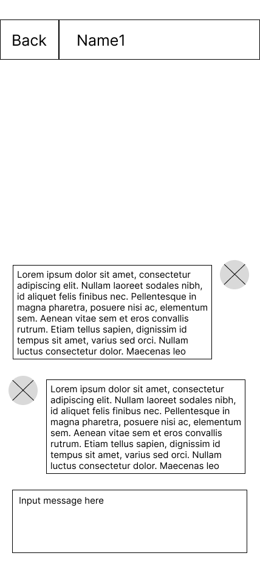

# User Experience Design

## Link to Prototype

## App map for Roommate Finder

## Wireframes for all Current Pages

### Login
Allows returning users to login to their accounts and directs new users to register for an account.  

### Registration
Allows new users to create an account.  

### Survey
New users are directed to this page after they create an account. Survey asks users to input their preferences in terms of roommates, this is used to generate a list of users that match the new user's preferences.  
 

### Top Matches
Users that most closely match the preferences a user expressed in their survey.  

### Other User's Profile
Shows what another user's profile looks like.   

### Other User's Preferences
Displays another user's preferences.  

### Chat Selection
Allows a user to view all of their ongoing conversations.  

### Chat
Displays how a user would be able to chat with another user  

### My Profile
Displays the user's profile, from here the user is able to update aspects of their profile.  

### Edit Profile
Allows the user to make updates to the contents of their profile.  

### My Preferences
Allows users to view and update their preferences.  

