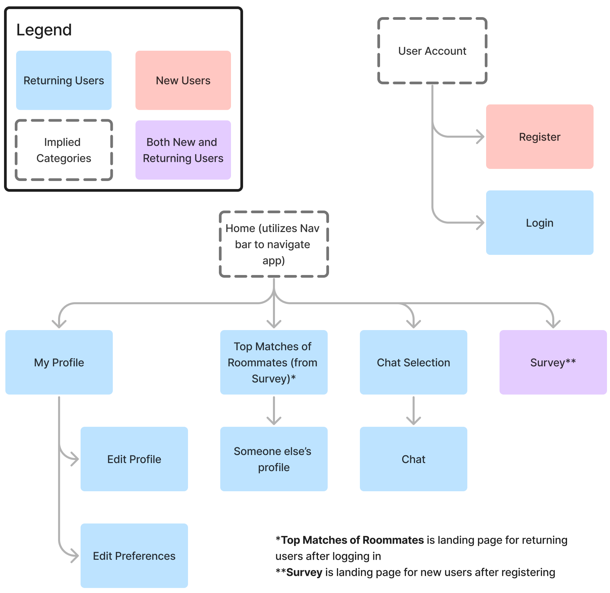

# User Experience Design

This repository contains instructions and files for two assignments that together comprise the user experience design phase of a web app.

Replace the contents of this file with the completed assignments, as described in:

- [app map & wireframe instructions](instructions-0a-app-map-wireframes.md).
- [prototype instructions](instructions-0b-prototyping.md)

## App map for Roommate Finder

## Wireframes
![Login] (ux-design/Wireframes/Login.png)

[Register] (ux-design/Wireframes/Register.png)

[Survey] (ux-design/Wireframes/Survey.png)

[Matches] (ux-design/Wireframes/Matches.png)

[Chats] (ux-design/Wireframes/Chats.png)

[My_Profile] (ux-design/Wireframes/My_Profile.png)

[Other_User_Profile] (ux-design/Wireframes/Other_User_Profile.png)

[Other_User_Preferences] (ux-design/Wireframes/Other_User_Preferences.png)

[Chat-Direct_Message] (ux-design/Wireframes/Chat-Direct_Message.png)

[Edit_Profile] (ux-design/Wireframes/Edit_Profile.png)

[My_Preferences] (ux-design/Wireframes/My_Preferences.png)